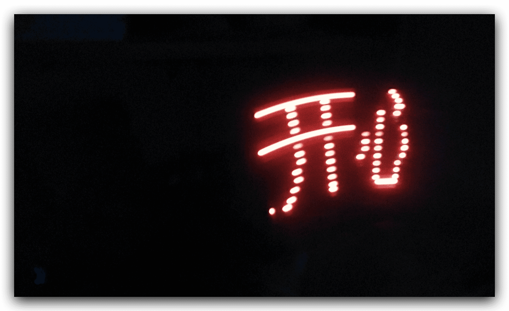

# 摇摇棒（POV LED）

## 简介

这是一个摇摇棒项目（POV LED），通过单排的 16 LED 灯，通过高速旋转，使得人眼看到的是一个完整的图像（96 x 16 点阵屏）。

### 说明

> 该项目完成于 2013 年 02 月，当时还没有学习到 git，所以没有使用 git 进行版本控制，现在将其上传到 github，以便日后查看。

## 字模编码

## 电路图

（待补充）

## 硬件

（待补充）

## 代码烧录

（待补充）

## 效果展示

